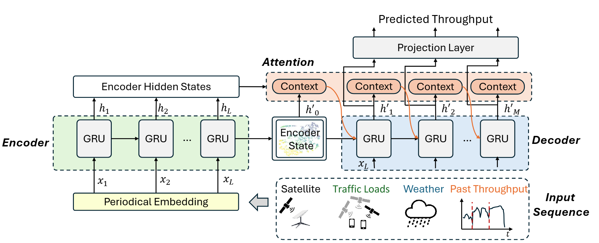

# StarNet, Vivisecting Starlink Throughput: Measurement and Prediction

This is the official repo of our paper: <br/>
> **[Vivisecting Starlink Throughput: Measurement and Prediction](https://dl.acm.org/doi/10.1145/3768971)**  
> Zikun Liu, Gabriella Fan-Xue, Sarah Tanveer, Deepak Vasisht    
> *CONEXT 2025* 
>

---


What this repo contains:

1) Starlink Satellite Tracker, a tool that allows you to obtain the Starlink Satellite that currently serving the dish. By utilizing the `starlink-grpc` library, this project enables you to monitor and trace the satellite that is within the line of sight of your dish in real time.
2) StarNet dataset, measured at 3 countries.
3) StarNet model, the neural network that we designed to predict the starlink throughput, details are described in the paper. Additional you can find a baseline based on timesnet for prediction comparison, as described in the appendix of our paper.

---
## Starlink Satellite Tracker

Summary of functions:

1. Measure the throughput between user device (where this tool runs on) and your server (e.g., Azure) through Starlink.
2. Measure the latency between user device and your server.
3. Obtain the serving satellite information (ID, distance, elelvation, azimuth, ...)


### Installation

1. Install the dependencies:

   ```
   cd ./starnet_tool
   pip install -r requirements.txt
   ```

2. Modify the server IP address to your server's IP address in tp_lt.py, `server_ip_iperf` and `server_ip_ping`

3. Run the script:

   ```
   python main.py
   ```

### Usage

- The network statistics (latency + throughput) will be saved into ./network_measurements.log
- The matching results demonstrations will be saved into ./figures, every 50 matches.
- The accuracy of our tool is around 90% by visual examination.

---
## StarNet Measurement Dataset

The following contains our dataset measuremed globally using the above tool. The cleaned datasets for each are dataset_tp_sat.pkl in each folder for model training purpose below.

US measurement: [link](https://uillinoisedu-my.sharepoint.com/:f:/g/personal/zikunliu_illinois_edu/IgBaSUJKNIjlQI6KeF1tWc6-AZMwiOlyueqSY4KzOYsVEfw?e=pD0Ix8)
Germany measurement: [link](https://uillinoisedu-my.sharepoint.com/:f:/g/personal/zikunliu_illinois_edu/IgBfbwMBpJDTSqbqvty7kK52AalnjRwNyiW-Xomy-iUD01A?e=ycoFNf)
Canada measurement: [link](https://uillinoisedu-my.sharepoint.com/:f:/g/personal/zikunliu_illinois_edu/IgDD3A4WdkPjQ4ME-CCIpk0GAfO40d2gSYm2k5skQMJVf-E?e=6eekvm)


---
## StarNet Model



### 1.Training

Run the script:

   ```
   cd ./model
   python main.py
   ```

Modify the dataset path in main.py, and choose which model(ours/timesnet as baseline) you want to train, the results will be saved into ./run folder that will be automatically created.

### 2.Testing

   ```
   cd ./model/NN_TP_ours
   python main_pred.py
   ```
   This will save the prediction plot and attention maps as shown in the paper into the eval folder.


### Citation

If you found this repository useful, please consider citing the paper:

```bibtex
@article{liu2025vivisecting,
  title={Vivisecting Starlink Throughput: Measurement and Prediction},
  author={Liu, Zikun and Reidys, Fan-Xue Gabriella and Tanveer, Sarah and Vasisht, Deepak},
  journal={Proceedings of the ACM on Networking},
  volume={3},
  number={CoNEXT4},
  pages={1--23},
  year={2025},
  publisher={ACM New York, NY, USA}
}
```


