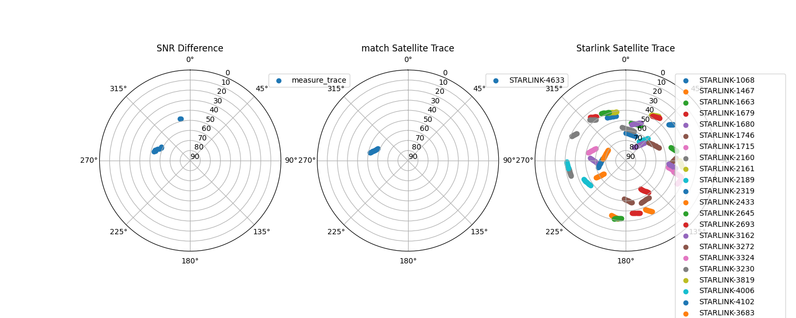

# StarNet, Vivisecting Starlink Throughput: Measurement and Prediction

This repo currently contains the Starlink Satellite Tracker, a project that allows you to obtain the Starlink Satellite that currently serving the dish. By utilizing the `starlink-grpc` library, this project enables you to monitor and trace the satellite that is within the line of sight of your dish in real time.

Summary of functions:

1. Measure the throughput between user device (where this tool runs on) and your server (e.g., Azure) through Starlink.
2. Measure the latency between user device and your server.
3. Obtain the serving satellite information (ID, distance, elelvation, azimuth, ...)



## Installation

1. Install the dependencies:

   ```
   pip install -r requirements.txt
   ```

2. Modify the server IP address to your server's IP address in tp_lt.py, `server_ip_iperf` and `server_ip_ping`

3. Run the script:

   ```
   python main.py
   ```

## Usage

- The network statistics (latency + throughput) will be saved into ./network_measurements.log
- The matching results demonstrations will be saved into ./figures, every 50 matches.
- The accuracy of our tool is around 90% by visual examination.

